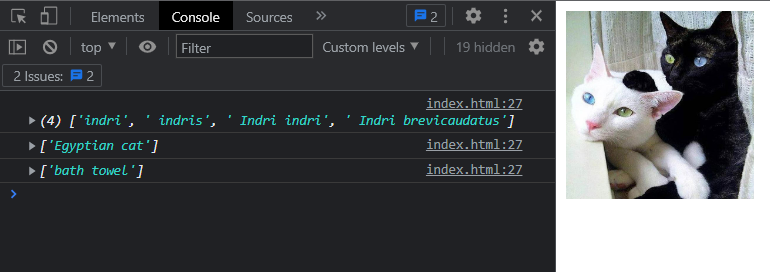

# Feature Extraction with Javascript
# Simple javascript code uses
```sh
https://cdn.jsdelivr.net/npm/@tensorflow/tfjs
https://cdn.jsdelivr.net/npm/@tensorflow-models/mobilenet
```
# Get Image Tag
```sh
const imgElement = document.getElementById("uploaded-image-url");
```
## Extract Function
```sh
async function searchImage(imgElement) {
    try {
            let net = await mobilenet.load();
            var analysedResult = [];
            const result = await net.classify(imgElement);
            result.forEach(function (value) {
                queryString = value.className.split(",");
                if (queryString.length > 1) {
                    analysedResult = analysedResult.concat(queryString);
                } else {
                    analysedResult.push(queryString[0]);
                }
                console.log(queryString);
            });
    } catch (error) {
        console.log(error);
    }
}
```

## Result
